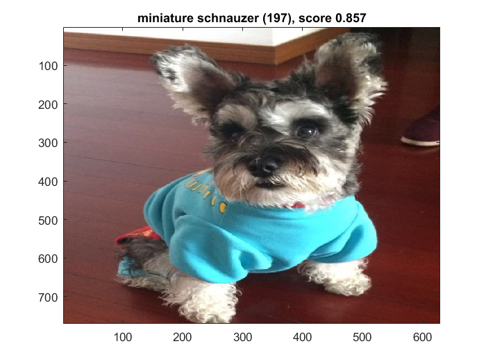
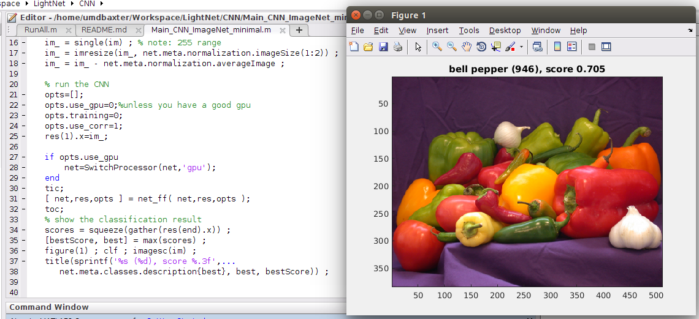

# LightNet: A Versatile, Standalone Matlab-based Environment for Deep Learning

LightNet is a lightweight, versatile and purely Matlab-based deep learning framework. The aim of the design is to provide an easy-to-understand, easy-to-use and efficient computational platform for deep learning research. The implemented framework supports major deep learning architectures such as the Multilayer Perceptron Networks (MLP), Convolutional Neural Networks (CNN) and Recurrent Neural Networks (RNN). LightNet supports both CPU and GPU for computation and the switch between them is straightforward. Different applications in computer vision, natural language processing and robotics are demonstrated as experiments.

## How to use LightNet

Read the tutorial slides in the Documentations folder.  
Install the latest Matlab (**R2016b or later**) on a computer, and run the RunAll.m Matlab script.  
Have fun!  
More details can be found in the supplementary materials.  

## Recent updates

20160528: LightNet supports using pretrained ImageNet network models. 

Check CNN/Main_CNN_ImageNet_Minimal()

An example recognition using imagenet-vgg-f pretrained net:

20170217: CUDNN is supported by installing Neural Network Toolbox from Mathworks. The convolutional network training is over 10x faster than the previous release! The current version can process 10,000 CIFAR-10 images per second in the training.

20170924: A simple example of training a Quasi-RNN is added to LightNet. Quasi-RNNs are much easier to parallelize compared to RNNs. 

## Major functions in LightNet
  
####network related:  
Main_Template: a template script used to train CNN and MLP networks.  
TrainingScript: a training template for CNN and MLP networks.  
train_net: running the network in the training mode to evaluate and calculate the loss and gradients.  
test_net: running the network in the testing mode to evaluate the current parameters.  
net_ff: implementation of the feed forward process which is used in CNN and MLP networks.  
net_bp: implementation of the back propagation process which is used in CNN and MLP networks.  
net_init*: how to initialize a neural network.  
  
####layers:  
linear_layer: implementation of (fully-connected) linear layer. (CUDNN enabled)   
conv_layer_1d: implementation of the 1d convolution layer. (CUDNN enabled)  
conv_layer_2d: implementation of the 2d convolution layer. (CUDNN enabled)  
maxpool: implementation of the 2d max-pooling layer. (CUDNN enabled)  
maxpool_1d: implementation of the 1d max-pooling layer. (CUDNN enabled)  
bnorm: implementation of the batch normalization layer.  
rmsnorm: implementation of the RMS normalization function.  
dropout: implementation of the dropout layer.  
lrn: implementation of the local response normalization layer. (CUDNN enabled)  
softmax: implementation of the softmax layer.  

####activation functions:  
relu: implementation of the rectified linear unit layer.  
leaky_relu: implementation of the leaky ReLU layer.  
modu: implementation of the modulus unit layer.  
sigmoid_ln: implementation of the sigmoid layer.  
tanh_ln: implementation of the tanh layer.  

  
####loss functions:  
softmaxlogloss: implementation of the softmax log loss layer .  
  
####optimization related:  
sgd: implementation of the stochastic gradient descent algorithm with momentum.  
sgd2: implementation of the second-order stochastic gradient descent algorithm with momentum.
adam: implementation of the Adam algorithm with modification that allows second-order training.  
rmsprop: implementation of the RMSProp algorithm with modification that allows second-order training.  
adagrad: implementation of the Adagrad algorithm with modification that allows second-order training.  
select_learning_rate: implementation of the Selective-SGD algorithm that automatically selects the optimal learning rate at the beginning or in the middle of the training.  
  
####utility functions:  
generate_output_filename: generate output filename based on the current parameter settings.  
im2col_ln: customized im2col function used in the pooling layer.  
unroll_ln: unroll overlapping signal windows into a matrix, used in the 1d pooling layer.  
pad_data*: a padding layer which is used in CNN.  
SwitchProcessor: a switch function between CPU and GPU.  

## How to accelerate LightNet  

Nvidia CUDNN can be used to calculate convolutions and linear transforms. 

1. You will need to install the Neural Network Toolbox from Mathworks. Make sure you can run it properly. (Ref to our tutorial slides.)  
2. Set opts.use_nntoolbox=1 in the main tesing script.  

## References  
1. Ye, C., Zhao, C., Yang, Y., Fermüller, C., & Aloimonos, Y. (2016, October). LightNet: A Versatile, Standalone Matlab-based Environment for Deep Learning. In Proceedings of the 2016 ACM on Multimedia Conference (pp. 1156-1159). ACM.  

